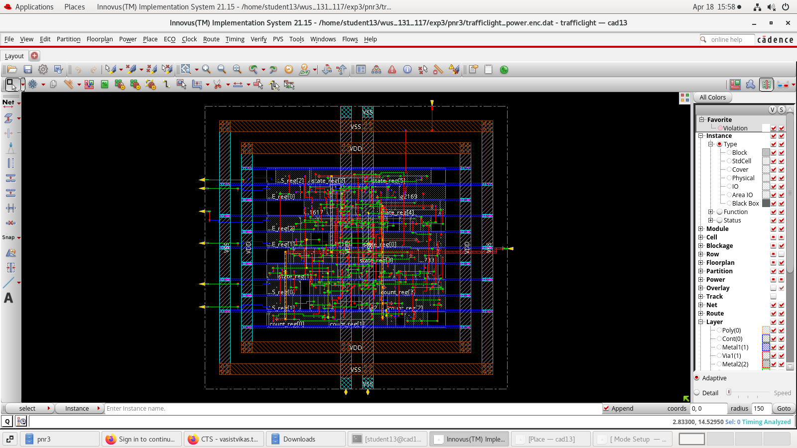

# traffic-light-controller-asic
Full RTL-to-GDS ASIC Physical Design Flow | Cadence Genus & Innovus | 90nm
# 🚦 Traffic Light Controller — Full RTL-to-GDS ASIC Flow

> Designed and implemented a complete ASIC physical design flow for a Traffic Light Controller FSM using **Cadence Genus** (Synthesis) and **Cadence Innovus** (Place & Route) on a **90nm technology node**.

---

## Overview

This project implements a **Finite State Machine (FSM)-based Traffic Light Controller** that manages North-South and West-East traffic signals across 6 states. The design was taken through the full RTL-to-GDS ASIC flow independently — from Verilog RTL all the way to a DRC/LVS-clean routed layout.

---

## Design Specifications

| Parameter | Value |
|---|---|
| Technology Node | 90nm |
| Tool (Synthesis) | Cadence Genus 21.14 |
| Tool (P&R) | Cadence Innovus 21.15 |
| FSM States | 6 (One-Hot Encoded) |
| Outputs | LED_NS [2:0], LED_WE [2:0] |
| Clock Period | 1 ns (1 GHz target) |
| Total Cell Count | 60 cells |
| Total Area | 535.128 µm² |
| Timing Slack (Setup) | +284 ps ✅ |

---

## FSM State Diagram

| State | LED_NS | LED_WE | Description |
|---|---|---|---|
| S0 | 🟢 Green | 🔴 Red | NS Green, WE Red (15 cycles) |
| S1 | 🟡 Yellow | 🔴 Red | NS Yellow, WE Red (2 cycles) |
| S2 | 🔴 Red | 🔴 Red | All Red transition (3 cycles) |
| S3 | 🔴 Red | 🟢 Green | WE Green, NS Red (2 cycles) |
| S4 | 🔴 Red | 🟡 Yellow | WE Yellow, NS Red (2 cycles) |
| S5 | 🔴 Red | 🔴 Red | All Red transition (2 cycles) |

LED encoding: `3'b001` = Green, `3'b010` = Yellow, `3'b100` = Red

---

## ASIC Flow

### Synthesis (Cadence Genus)
- Library: 90nm typical.lib
- Synthesis steps: `syn_generic` → `syn_map` → `syn_opt`
- Output: Gate-level netlist, output SDC, timing/area/power/gates reports

### Place & Route (Cadence Innovus)
- Floorplanning, Power Planning (Rings & Stripes)
- Standard cell placement and routing
- Clock Tree Synthesis (CTS)
- Timing closure: Setup slack = **+284 ps** at 1 GHz
- Zero DRC violations at physical verification

---

## Key Results

### Area Report
| Type | Instances | Area (µm²) | % |
|---|---|---|---|
| Sequential | 16 | 338.334 | 63.2% |
| Logic | 37 | 180.899 | 33.8% |
| Inverter | 7 | 15.895 | 3.0% |
| **Total** | **60** | **535.128** | **100%** |

### Timing Report (Critical Path)
- **Startpoint:** `state_reg[3]/CK`
- **Endpoint:** `count_reg[2]/D`
- **Data Path Delay:** 616 ps
- **Slack:** +284 ps ✅ (Timing MET)

---

## Layout

---

## Repository Structure

---

## Tools & Technologies

- **HDL:** Verilog
- **Synthesis:** Cadence Genus 21.14
- **Physical Design:** Cadence Innovus 21.15
- **Technology:** 90nm digital standard cell library
- **Verification:** Functional simulation, DRC/LVS checks

---

## Author

**Vasist Vikas Reddy T**
B.E. Electronics and Communication Engineering
Chaitanya Bharathi Institute of Technology, Hyderabad

